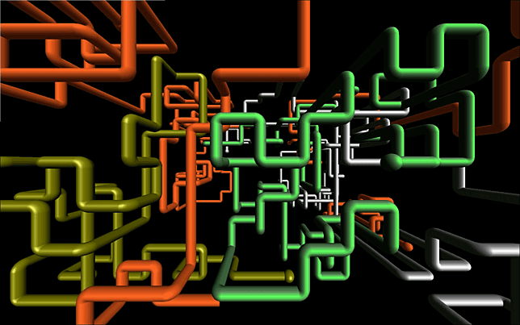
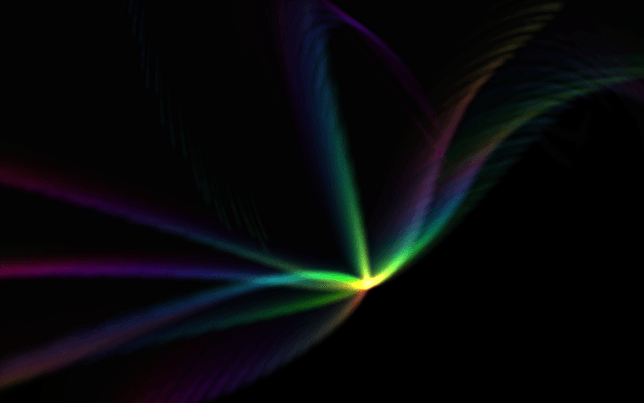
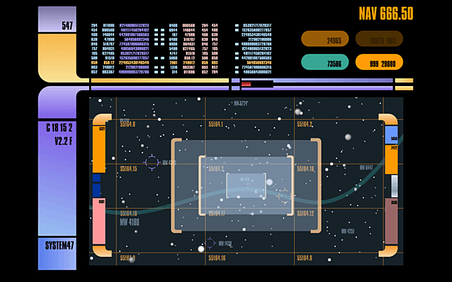
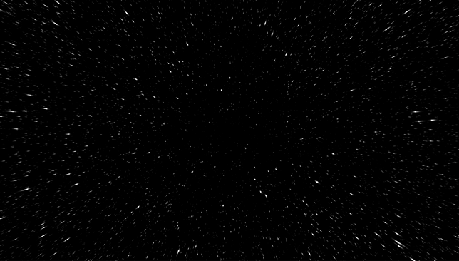
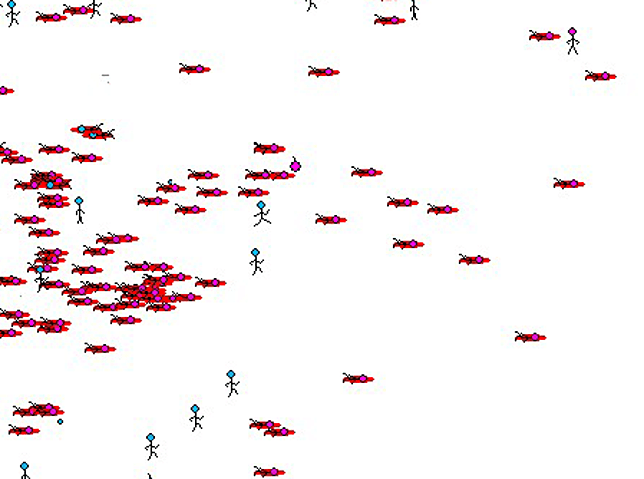

# Screensavers for RPI4 / Twister OS
This is a collection of windows screensavers and install scripts for installing them.

Screensavers are saved to /home/pi/.screensavers

Please stop running screensaver when installing a new one.

# Find more Screensavers Here
https://www.screensaversplanet.com/

# Screenshots

