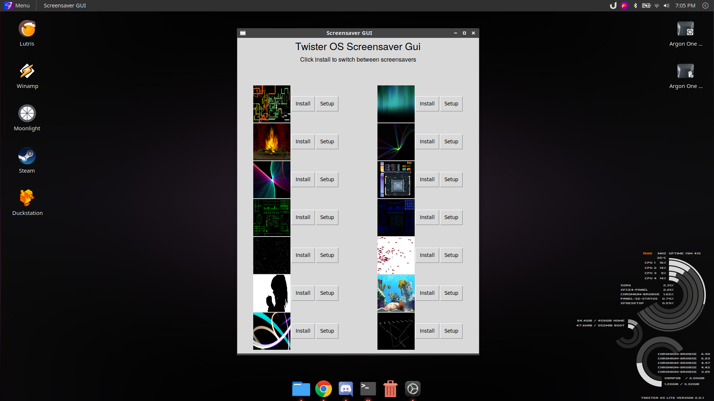

# Screensavers for Twister OS
This is a collection of windows screensavers and install scripts for enhancing the look and feel of Twister OS Windows styled themes.

# Install

Open terminal and run the following:

git clone https://github.com/phoenixbyrd/Screensavers.git
cp /home/pi/Screensavers/ScreensaversGUI.desktop /home/pi/.local/share/applications

When winecfg.exe window shows set Windows Version to Windows XP, click apply and then OK

# Commands for controlling the screensaver service

Reload service daemon         : sudo systemctl daemon-reload
Verify service is running     : sudo systemctl status screensaver
Enable on startup             : sudo systemctl enable screensaver
Start screensaver service     : sudo systemctl start screensaver
Stop screensaver service      : sudo systemctl stop screensaver

